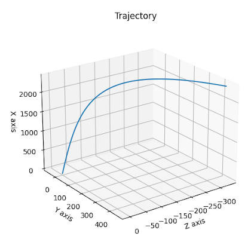
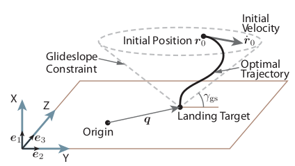
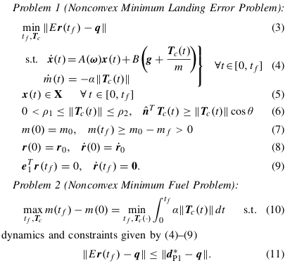
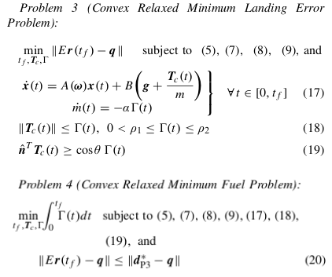
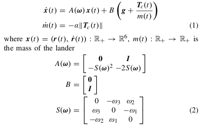

# Soft landing with Convex Optimization
> Program implemented to compute optimal solution for the soft landing problem based on a lossless convexification.   

## Table of contents
* [General info](#general-info)
* [Screenshots](#screenshots)
* [Setup](#setup)
* [How to run ](#how)
* [Updates](#updates)
* [To-do list](#to-do)

## Screenshots
Trajectory generated by the script.   
### Trajectory in 3D   

      

## General info
Implemented soft landing powered decent guidance optimization problem based on the paper   

[Lossless Convexification of Non-Convex Control Bound and Pointing Constraints of the Soft Landing Optimal Control Problem.](http://www.larsblackmore.com/iee_tcst13.pdf)     
B. Acikmese, J. M. Carson III, and L. Blackmore. IEEE Transactions on Control Systems Technology, Volume 21, Issue 6 (2013).   
***   

&nbsp;         
One of the most critical aspects of a planetary landing mission is the powered-descent phase, which terminates with a soft touchdown on the surface.     

   

However, the problem is a nonconvex finite-horizon optimal control problem in its original form because of the control constraints.    

Source of nonconvexity:    

1. Thrust vectors with a nonzero minimum and maximum on the thrust magnitude     
2. Thrust vector pointing direction    
3. Time-varying mass in the dynamics

The planetary soft landing problem can be formulated as a prioritized optimization problem as
follows.

   

The solution of the soft landing problem is obtained by solving Problems 1 and 2. The motivation for this two-step prioritization approach is quite intuitive. The primary goal of planetary landing problem considered in this paper is to land a vehicle as close to a given target as possible, i.e., to minimize the landing error as in Problem 1. There can be multiple optimal solutions for this problem, hence we have a second step where we find the minimum error solution that consumes the least fuel, as in Problem 2.          
&nbsp;    

Its proposed with the following relaxed minimum-error and fuel-optimal control problems that are convex relaxations of Problems 1 and 2.   

   
&nbsp;    

### Algorithm    

1. Solve the relaxed minimum-landing-error guidance problem (Problem 3) to obtain dP3 (final optimal position). If no solution exists, return infeasible.  
2. Solve the relaxed minimum-fuel guidance problem to specified range (Problem 4) with dP3 calculated earlier.   
  
&nbsp;   
The lander is modeled as a lumped mass with a thrust vector for control, and its dynamics are described by,    

   

*  ω = (ω1, ω2, ω3) ∈ R3 is the vector of planet’s constant angular velocity   
*  g ∈ R3 is the constant gravity vector, and     
*  α > 0 is a constant that describes the fuel consumption (mass depletion) rate.   

&nbsp;     
Euler integration ( w[t+1] = w[t] + dt * f(t,w[t]) ) is used for solving the dynamics equation along each time step, which are added in the relevant constraints for the cvxpy problem.  
&nbsp;    
### Convex Optimization    

Python library CVXPY [ https://www.cvxpy.org/ ] used for optimization,    
&nbsp;        
Weighted sum cost function approach is used and multiple objectives are weighted and summed together to create a composite objective function. Optimization of this composite objective results in the optimization of individual objective functions.     
&nbsp;   

## Setup
Script is written with python (Version: 3.6) on linux. Additional modules required :   

* numpy  (tested with Version: 1.18.4 )
* matplotlib  (tested with Version: 2.1.1 )
* CVXPY (tested with Version: 1.2)

## How to run   
* Verify and install required modules 
* run `python soft_landing_optimizer.py`. 

## Updates   
*   
*   *  

## To-do list
* 

